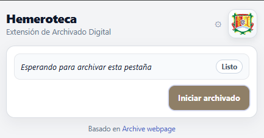
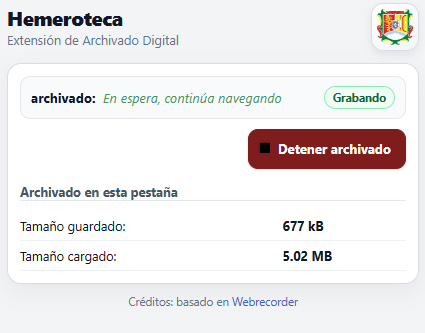
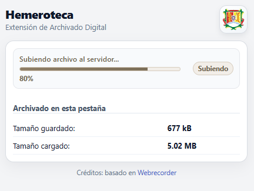

<div align="center">
  
</div>

# Extensión de Archivado Digital (Hemeroteca SIAI)

[](#)
[](#)
[](#)

> Extensión para **navegadores basados en Chromium** orientada al módulo de hemeroteca del **SIAI (Sistema Integral de Análisis de Información)**.
> Permite **capturar**, **almacenar** y **reproducir** archivos web de alta fidelidad directamente desde el navegador,
> guardándolos en almacenamiento local del navegador (**IndexedDB**).

---

## Tabla de contenidos

- [Información general](#información-general)
- [Navegadores compatibles](#navegadores-compatibles)
- [Inicio rápido (desarrollo)](#inicio-rápido-desarrollo)
- [Capturas de pantalla](#capturas-de-pantalla)
- [Arquitectura](#arquitectura)
- [Scripts disponibles](#scripts-disponibles)
- [Resolución de problemas](#resolución-de-problemas)
- [Créditos](#créditos)

## Información general

- **Base tecnológica:** deriva del proyecto **ArchiveWeb.page**.
- **Guía funcional de referencia:** [ArchiveWeb.page User Guide](https://archiveweb.page/guide).

## Navegadores compatibles

La extensión depende de **Manifest V3**, la API **`chrome.debugger`** y otras APIs de **Chrome Extensions**, por lo que su compatibilidad está orientada a navegadores **basados en Chromium**.

| Navegador | Compatibilidad |
| --- | --- |
|  | Compatible |
|  | Compatible |
|  | Compatible |
|  | Compatible |
|  | Compatible |

> Nota: en navegadores no basados en Chromium, o en variantes que restrinjan el uso de `chrome.debugger`, la extensión puede no funcionar correctamente.

---

## Inicio rápido (desarrollo)

### Requisitos previos

- **Node.js:** >= 12 (recomendado: LTS reciente).
- **Yarn Classic (v1)**.

### Instalación

1. Clona este repositorio y entra al directorio:

   ```sh
   git clone <URL_DE_ESTE_REPOSITORIO>
   cd webarchiver-extension-fisnay
   ```

2. Instala dependencias:

   ```sh
   yarn install
   ```

3. Compila en modo desarrollo:

   ```sh
   yarn build-dev
   ```

### Cargar la extensión en Chromium

1. Abre `chrome://extensions`.
2. Activa **Modo desarrollador**.
3. Selecciona **Cargar descomprimida** y elige la carpeta `./dist/ext`.

Para desarrollo iterativo (watch):

```sh
yarn start-ext
```

---

## Capturas de pantalla

| 1) Pantalla de inicio | 2) Proceso de archivado en curso | 3) Finalización y guardado (Uploading) |
| --- | --- | --- |
|  |  |  |

---

## Arquitectura

La extensión hace uso del protocolo de depuración de Chrome para capturar y guardar tráfico de red, y extiende la interfaz de [ReplayWeb.page](https://github.com/webrecorder/replayweb.page) y el service worker [wabac.js](https://github.com/webrecorder/wabac.js) para reproducción y almacenamiento.

---

## Scripts disponibles

| Script | Descripción |
| --- | --- |
| `yarn build-dev` | Build de desarrollo. |
| `yarn start-ext` | Compilación en modo watch para iteración rápida. |
| `yarn build` | Build de producción. |
| `yarn lint` | Lint del proyecto. |
| `yarn format` | Formato automático. |
| `yarn dist` | Empaquetado para distribución. |

---

## Resolución de problemas

### No se reflejan cambios en la extensión

- Si usas `yarn start-ext`, recarga la extensión en `chrome://extensions`.
- Recarga la extensión en `chrome://extensions`.
- Recarga la página objetivo que estás archivando.

### Error al cargar la extensión

- Asegúrate de cargar exactamente `./dist/ext` (no `./dist`).
- Ejecuta `yarn build-dev` nuevamente.

### Inconsistencias de dependencias

```sh
rm -rf node_modules
yarn install
```

En Windows (PowerShell):

```powershell
Remove-Item -Recurse -Force node_modules
yarn install
```

---

## Créditos

Basado en el ecosistema de Webrecorder:

- [ArchiveWeb.page](https://archiveweb.page/)
- [ReplayWeb.page](https://github.com/webrecorder/replayweb.page)
- [wabac.js](https://github.com/webrecorder/wabac.js)